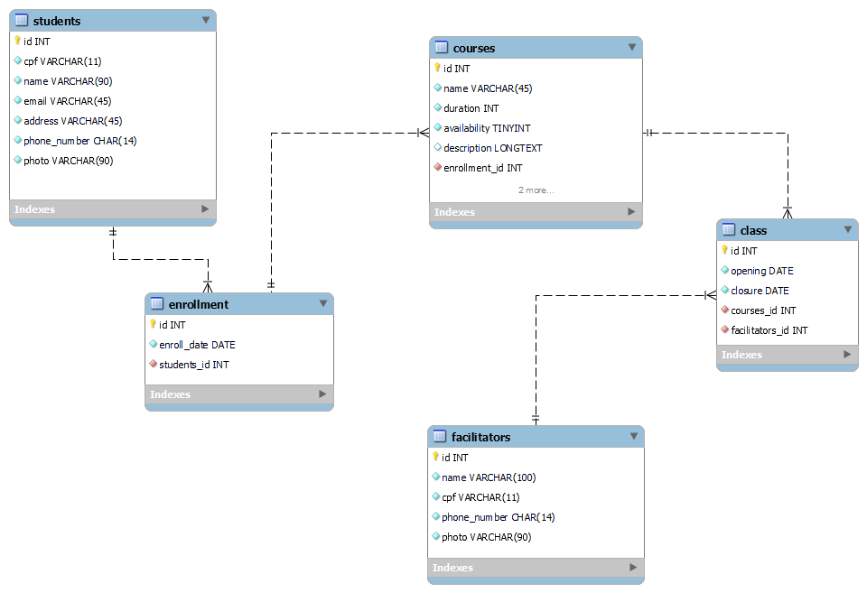

# Trabalho individual módulo IV
Desenvolvendo um novo Banco de Dados para a Resilia Cursos.

Perguntas a serem respondidas:

### I - Existem outras entidades além dessas três?
 Além de aluno, turma e curso, neste diagrama foi criada a entidade para os facilitadores, que é o responsavel pelos alunos em sala, assim como também desenvolve um papel essêncial na resolução de problemas e entendimento do material disponibilizado pela Resilia, participando deste mesmo ponto de vista, há uma brecha para adicionar uma nova tabela, tabela essa de Monitores, pois fazem parte do conjunto dos que integram estas salas, no entanto neste exemplo não utilizaremos.

### II - Quais são os principais campos e tipos?

<strong>id</strong> - _com o tipo INT e NN (Um inteiro de tamanho normal que não pode ser NULO)_ 
<strong>name</strong> - _com o tipo VARCHAR (Uma sequência de caracteres de texto de tamanho a ser definido)_ 
<strong>email</strong> - _com o tipo VARCHAR (Uma sequência de caracteres de texto de tamanho a ser definido)_ 
<strong>cpf</strong> - _com o tipo CHAR (Uma sequência de caracteres de texto de tamanho fixo)_ 
<strong>enroll_date</strong> - _com o tipo DATE (Responsável por armazenar uma hora ou data, neste caso de matrícula)_ 
<strong>duration</strong> - _com o timpo INT (Responsável por armazenar pequenos números inteiros, neste caso horas de curso totais)_ 
<strong>opening</strong> e <strong>closure</strong> - _com o tipo DATE (Armazenando dados de inicio e conclusão deste curso em questão)_ 

### III - Como essas entidades estão relacionadas?

- O pontapé inicial para esse diagrama de relações foi pelo objeto <strong>students</strong>, o mesmo possui: name, cpf, address, email, phone_number e photo para diferenciarmos o cadastro destes estudantes, o maxímo de informações úteis, é preciso, para a criação deste perfil.

- A partir disto criei a tabela de <strong>courses</strong>, recebendo entre students e a mesma a tabela de enrollment que simboliza a matricula, pois os alunos são matriculados na instituição de ensino e as matriculas vão para os cursos disponíveis. Ainda sobre disponibilidade, utilizamos <strong>availabillity</strong> recebendo dados BOOLEAN(TINYINT onde recebe 0 ou 1, false e true respectivamente) para saber se haverá disponibilidade para novas matrículas. 

- Após, criamos a tabela de Turmas, chamada de <strong>class</strong> onde receberá esses cursos, e por fim para lecionar essas aulas, a tabela de facilitadores de ensino, chamada de <strong>facilitators</strong>. 
